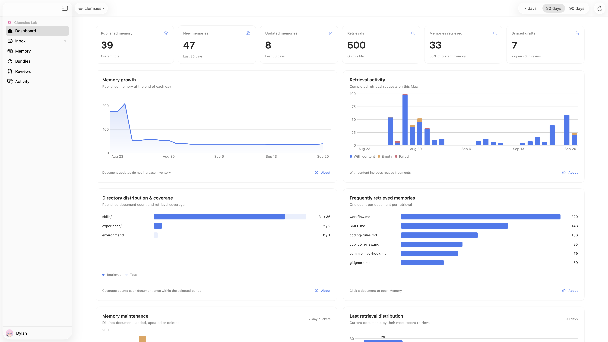

# Clumsies

<p align="center">
  
</p>

[English](README.md) · [简体中文](README.zh-CN.md) · [技术文档](https://docs.clumsies.ai/zh/)

[](https://github.com/lilhammerfun/clumsies/actions/workflows/ci.yml)
[](LICENSE)

> **体验版已提供 macOS 安装包。** [下载 DMG](https://github.com/lilhammerfun/clumsies/releases)，无需自行编译。当前版本尚未经过 Apple 公证，首次打开步骤见下方说明。

Clumsies 帮助团队维护供 Coding Agent 使用的 Markdown 知识，例如架构决策、项目约束和操作流程。组织保存已发布的 **Memory**；每个 **Project（项目）** 选择需要使用的 Memory，再与本地仓库绑定。Agent 在工作时检索相关指导，也可以在用户明确要求后提出修改。



*在 macOS 仪表盘中查看 Memory 变化趋势、检索活动和覆盖情况。*

## 怎样使用

[快速开始](https://docs.clumsies.ai/zh/quickstart/)围绕一条完整流程展开：

1. 创建 Project，绑定实际工作的仓库。
2. 从组织中选择这个项目需要的 Memory。
3. 在启用 Clumsies 集成的 Codex 中工作，由它随任务检索相关 Memory。
4. 约定或流程需要调整时，明确要求 Codex 修改 Memory。
5. 在 Clumsies 中检查生成的 Draft（草稿），由人提交 Review，再由组织 owner 或 admin 批准并发布。

检索不会自动改写 Memory。保存草稿表示提出修改，正式发布需要人工审阅。发布前，草稿就可能影响这个 Project 的本地 Memory 视图。

## 安装并开始使用

支持 **macOS 14 及以上版本，Apple Silicon Mac（M1 及更新机型）**。直接安装无需 Xcode、Rust 或其他编译工具。

1. 打开 [GitHub Releases](https://github.com/lilhammerfun/clumsies/releases)，在最新的 **Clumsies macOS Preview** 中下载 `Clumsies-*-macos-arm64.dmg`。
2. 打开 DMG，将 **Clumsies.app** 拖入 **Applications（应用程序）**，推出磁盘映像，再打开已安装的 App。
3. 当前体验版尚未经过 Apple 公证。首次打开若被拦截，确认文件来自本仓库后，到 **系统设置 → 隐私与安全 → 仍要打开** 放行。受管理的 Mac 可能不允许此操作。[Apple 操作说明](https://support.apple.com/zh-cn/102445)
4. 保留默认 Server 地址 **`https://app.clumsies.ai`** 并登录；需要该组织已经准入的账号。接入其他部署时，使用团队提供的 Server 地址。

安装后，按[快速开始](https://docs.clumsies.ai/zh/quickstart/)连接组织、创建项目并接入 Agent。体验版更新时，退出 App，下载新的 DMG 并替换原位置的应用；账号、Memory 和设置会保留。

如果此前安装在 `~/Applications/Clumsies.app`，请退出 App 后在该位置替换，避免保留两份应用。需要从源码安装时，请阅读[源码安装说明](https://docs.clumsies.ai/zh/quickstart/install#从源码安装)。

### 让 Agent 帮你安装

```text
请帮我安装 Clumsies，下载页面：
https://github.com/lilhammerfun/clumsies/releases

选择最新 Clumsies macOS Preview 的 DMG，将其中的 Clumsies.app 安装到
应用程序目录；已有安装时退出 App 并在原位置替换，保留账号、Memory 和设置。
沿用内置 Server 地址。不要创建 Dev Instance，也不要启动本地 Server。
macOS 首次打开授权和登录需要我操作时，告诉我具体步骤。
安装后引导我按 Clumsies 的快速开始连接组织、创建项目并接入 Agent。
```

## Agent 支持与使用条件

当前实现包含 macOS Codex App、Claude Code、opencode、DeepSeek Harness（`dsh`）和 Google Antigravity 的集成。Agent 宿主需要自行安装。适配器按本机用户安装一次，供所有项目使用；首次设置默认勾选 Codex。仓库绑定决定 Agent 使用哪个 Project 的 Memory。

修改 Codex 集成后，需要重启 Codex 并新建任务。检索需要本地 daemon 运行、索引就绪；首次使用会下载检索模型。各宿主的具体要求见 [Agent 接入](https://docs.clumsies.ai/zh/guides/agent-runtime)。

团队也可以自行部署 Rust Server 和 PostgreSQL，接入自己的 OIDC 身份提供方，详见[组织部署](https://docs.clumsies.ai/zh/guides/deploy-for-an-org)。

## 了解项目设计

[项目概览](https://docs.clumsies.ai/zh/overview) · [系统架构](https://docs.clumsies.ai/zh/architecture) · [数据模型](https://docs.clumsies.ai/zh/data-model) · [领域接口](https://docs.clumsies.ai/zh/reference/domain-api) · [开发流程](https://docs.clumsies.ai/zh/guides/development-workflow)

## 开源协议

[MIT](LICENSE) © 2026 Clumsies Lab
