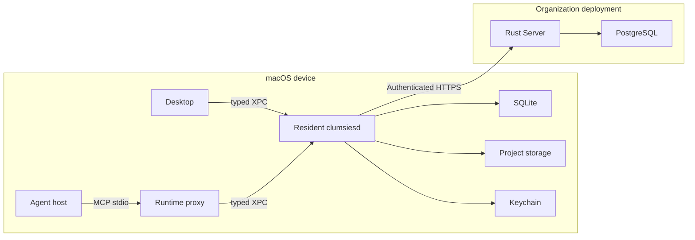

# System architecture

Clumsies separates two responsibilities: **a developer's Mac saves proposals, synchronizes data, and runs retrieval; the organization's Server manages shared content and authorizes publication.** Desktop and agents use the same local background process, so their drafts come from the same local state.

This page explains which processes handle a request, where data lives, who can change it, and why these boundaries exist. Start with [Meet Clumsies](/overview) if the product is new to you. Field-level detail belongs in [Core data structures](/data-model).

## The system at a glance

The left boundary is the user's macOS device; the right is the organization's deployment. Sign-in, initial setup, and administrator recovery use separate paths described below.

| Component | What it is | Role in a deployment rollback checklist example |
| --- | --- | --- |
| Desktop | Native Swift macOS application | Display and edit the checklist, review differences, confirm publication |
| Agent host | The application running a coding agent | Call the `memory` tool during a task |
| Runtime proxy | A protocol-proxy process using the bundled `clumsiesd` | Convert MCP into typed local requests |
| Resident daemon | Rust `clumsiesd`, managed by launchd | Persist drafts, synchronize, prepare effective content, run retrieval |
| Server | Rust HTTP service using Axum | Authenticate, save shared Drafts/Reviews, publish transactionally, serve snapshots |
| PostgreSQL | The Server's relational database | Persist members, published content, proposals, reviews, and version history |

The proxy and daemon use **one executable in the App bundle**, started in different modes. Ordinary startup runs the resident service; `mcp serve` runs the MCP proxy. Proxies do not open business databases, load models, or run synchronization workers.

## Why these layers exist

**Closing a window should not stop background work.** An agent may still read or edit the checklist after Desktop closes. Keeping drafts and queues in the daemon makes edits independent of a window and gives Desktop and agents one synchronization and retrieval implementation.

**Local editing and organization publication need different permissions and availability.** Saved edits must survive temporary network failure, but one Mac cannot declare its version official for the organization. The Server checks membership, draft versions, and the current published state.

**A content snapshot and its search index have different responsibilities.** A published Commit is versioned content that must be verified. An index is a rebuildable structure derived from that content. Index failure must neither change published content nor make an outdated index appear current.

## Where data lives

Local state includes both unsynchronized edits and rebuildable caches. They must not be cleared indiscriminately.

| Location | Contents | Ownership and durability |
| --- | --- | --- |
| Server PostgreSQL | Organizations/Projects, members, published Memory, Drafts/Reviews, Blob/Tree/Commit/Ref, audit | Shared server state; the Organization Ref identifies the published version |
| Central daemon SQLite | Project bindings, local drafts and operation queues, cached objects/Refs, retrieval history | Includes edits that may not have reached the Server; not a disposable cache |
| Project Local Storage | Verified Commit file snapshots and Effective Memory search indexes | Rebuildable derived data, managed per Project |
| macOS Keychain | Server access/refresh token pair | Credentials stored separately from content and SQLite |
| Daemon model cache | Embedding and reranker model files | Local retrieval dependencies shared across Projects |

Users may choose a custom Project Local Storage location. The Server never receives that local path or macOS bookmark. A move builds and verifies the destination before switching its registration; existing reads finish before old storage is cleaned up. See [Local runtime](/runtime).

## From published content to an agent's view

Suppose an organization publishes a deployment rollback checklist and a Project selects it.

1. The **Organization Ref** points to the organization's current Commit. A Ref is a movable head pointer; a Commit is an immutable snapshot.
2. A **Project selection** contains Memory IDs. The Server produces the Project's Commit and Ref from the selected content. This is a projection, not a separate authority for publishing organization content.
3. The daemon downloads that Project Commit, validates its Tree, Blobs, paths, and ownership, then installs a local file snapshot called a generation.
4. Resources without active drafts use the installed projection. For a resource with a draft, the daemon computes the full result from **that draft's Base snapshot + operations**, then overlays it onto the resource. This produces **Effective Memory**.
5. `activate` searches an index matching the effective content hash; `load` reads complete current resources by ID or path.

A creation Draft may have no existing resource, and its Base can be absent when the Organization has no snapshot yet. When upstream content changes, an existing Draft Base does not silently move. Otherwise the same operations might apply to different text. The system reports `behind` and uses three-way comparison so the user can confirm a new result.

Each read uses an identifiable snapshot, but content can change between separate calls. Reload before editing and supply the returned `content_hash`; an earlier search is not a guarantee about the content at write time. See [Data structures](/data-model) for the different version fields.

## The boundaries of one edit

| Stage | Request and processing | What success proves |
| --- | --- | --- |
| Local save | Desktop or MCP → daemon; a SQLite transaction writes operations and the sync queue | This device has saved the edit |
| Synchronization | daemon → Server HTTP; create/reuse a draft, append operations, pull changes | The Server has saved a shared proposal |
| Review submission | Desktop → daemon → Server; ordered drafts, versions, and required reconciliation candidates | The draft set has entered review |
| Publication | Desktop Approve calls merge; the Server checks roles, Review/Draft state, and Ref in a transaction | One result Commit contains the set; the Organization Ref advances |
| Read readiness | The Server refreshes affected Project projections; the daemon downloads, verifies, installs, and prepares an index | This device can answer using the new version |

A standalone HTTP `approved` decision does not publish. Desktop's current Approve action uses the merge route to publish. The Server can merge an `open` or `approved` Review. See [Domain interfaces](/reference/domain-api) and [End-to-end flows](/flows).

Local save, upload, Commit download, index preparation, and page rendering have separate completion conditions. A successful submission followed by a loading page needs measurements at those boundaries; one HTTP `200` does not establish readiness of the entire operation.

## Domains inside the Server

These are modules in one Server process, not separately deployed microservices.

| Domain | Question it answers | Source directory |
| --- | --- | --- |
| Installation | How is initial configuration completed and authorized? | `installation/` |
| Auth | Who is the user, and is the session valid? | `auth/` |
| Organization | What are the members, roles, and Project permissions? | `organization/` |
| Memory | What are the published content, selections, Bundles, and snapshots? | `memory/` |
| Changes | How are drafts synchronized, reconciled, reviewed, and published? | `changes/` |

These directories live under `crates/server/src/`. HTTP code translates requests and responses; service/storage code implements use cases, authorization, and PostgreSQL transactions. `http.rs` assembles the routes. See [Codebase map](/repos) to navigate by operation.

## Identity and trust boundaries

- **Sign-in:** Desktop opens the organization's OIDC identity provider in a system browser. The Server verifies identity. Desktop exchanges the authorization code and passes the token pair to the daemon over XPC for Keychain storage. The daemon adds bearer credentials to normal Server requests.
- **Project binding:** The daemon resolves the longest bound ancestor of the current directory within the normalized Server authority. Managed agent proxies recheck binding and runtime identity to avoid using a Project after its directory is rebound.
- **Publication:** Project members can propose and submit edits; Organization owners/admins decide publication. Role checks do not replace version or `If-Match` concurrency checks.
- **Local diagnostics:** Retrieval history and host Activity projections remain on the device. They are distinct from Draft content synchronized to the Server.

Initial setup and administrator recovery when the daemon is unavailable use restricted direct HTTPS requests from Desktop to the trusted Server origin. These are exceptions to the diagram's normal data path. Admin APIs use bearer authentication; setup cookies/CSRF do not form a general browser administration session. See [Authentication and sessions](/reference/auth).

## What failures preserve

| Failure | State preserved and recovery principle |
| --- | --- |
| Draft upload fails | Operations committed locally remain queued; repair connectivity or sign-in and retry |
| Upstream, candidate, or version changes | Reject stale submission/merge; reread, compare, and confirm without overwriting concurrent publication |
| Commit download or validation fails | Do not install a partial generation or advance its local Ref |
| Index does not match effective content | Report preparation/failure rather than answering from the wrong index |
| Custom storage volume is unavailable | Report unavailable storage; drafts and queues remain in central SQLite |
| Agent proxy and resident versions differ | Return an explicit runtime mismatch; restart the relevant processes after updating |

See [Troubleshooting](/guides/troubleshooting). Commit downloads currently transfer a full payload rather than incremental objects, and the local runtime uses macOS launchd/XPC. Field compatibility and implementation gaps are documented in [Data structures](/data-model), [HTTP contracts](/reference/http-api), and the relevant subsystem pages.

## Continue into the implementation

- [Server route assembly](https://github.com/lilhammerfun/clumsies/blob/5d038ffb0ad6e170680618a8fcd0e1ff3d760f77/crates/server/src/http.rs): interfaces and authentication groups.
- [Daemon startup](https://github.com/lilhammerfun/clumsies/blob/5d038ffb0ad6e170680618a8fcd0e1ff3d760f77/crates/daemon/src/main.rs): resident/proxy modes and background workers.
- [Draft synchronization](https://github.com/lilhammerfun/clumsies/blob/5d038ffb0ad6e170680618a8fcd0e1ff3d760f77/crates/daemon/src/draft.rs), [Commit installation](https://github.com/lilhammerfun/clumsies/blob/5d038ffb0ad6e170680618a8fcd0e1ff3d760f77/crates/daemon/src/commit_sync.rs), and [effective-content overlay](https://github.com/lilhammerfun/clumsies/blob/5d038ffb0ad6e170680618a8fcd0e1ff3d760f77/crates/daemon/src/search/overlay.rs): three separate processing stages.
- Next: [Core data structures](/data-model), connecting the diagram's names to objects, fields, and relationships.

Server resources live under `crates/server/src/app/`. Each resource contains its routes, handlers, DTOs, operations, persistence and models as needed. Resource-owned clients remain inside the resource; shared database infrastructure lives in `infra/` and explicit maintenance commands in `maintenance/`. See [Server source organization](https://github.com/lilhammerfun/clumsies/blob/main/crates/server/README.md) for the dependency boundaries and validation commands.
