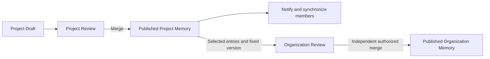

# Project and Organization Memory ownership

Decision accepted: 2026-09-23. Implemented in this change.

This decision supersedes the **target design** of Organization-only publication in [Unified Memory design](/unified-memory-model) and the [2026-08-26 authority cutover](/project-authority-migration). Those pages preserve the historical cutover. This document describes the current ownership contract.

## Problem and decision

A Project must be able to accept repository-specific knowledge without publishing it to the Organization. For example, Payments can approve its deployment rollback checklist even when that checklist is unsuitable for other projects. A later, generalized checklist can be contributed to the Organization independently.

Keep one Memory type and one Draft/Review mechanism. Allow two owners: a particular Project or the Organization. Every Review has exactly one publication target. Editing in a Project defaults to that Project; contributing to the Organization is explicit.

| Concept | Responsibility |
| --- | --- |
| Project Memory | The Project's accepted knowledge, shared with its members. |
| Organization Memory | Accepted shared knowledge that Projects can select. |
| Project Org Selection | A read relationship to Organization resources, without write-back authority. |
| Draft / Review | Ordered proposed changes to one target, with that target's versions and permissions. |
| Member installation | A synchronized snapshot and local proposals, not a separate published branch. |

## Publication and member synchronization

Saving creates a durable Draft and schedules synchronization. It does not publish to the Project or Organization. A Draft preview is distinguishable from the published baseline; seeing a proposal is not accepting it for every member.

Merging a Project Review changes only Project-owned resources, advances the Project snapshot, and records the update for member notification and synchronization. Organization publication requires its own authorized Review. Project maintenance permission does not grant Organization publication permission.

Each Project has one current published snapshot, composed from its own accepted Memory and selected Organization Memory, with explicit Project adaptations taking precedence. The Project Ref remains the download unit; updating a selected Organization resource can refresh this snapshot without modifying Project-owned resources. Installed snapshots and retrieval indexes must identify the actual content version they contain.

| Member state | Behavior after a Project update |
| --- | --- |
| No open changes | Automatically install the new snapshot and record an update notification; no acknowledgement is required. |
| Draft can reconcile cleanly | Automatically reconcile against the new baseline using version checks. Changed approved results invalidate approval. |
| Draft has conflicts | Preserve the Draft and its baseline; notify its author. Do not apply unresolved operations to the new baseline or block other members. |
| Offline or synchronization failed | Retry synchronization and show installation status separately from publication and content conflicts. |

Reuse Base / Current / Draft Result reconciliation. A clean comparison is not permission to publish. A stale candidate must be recomputed; retries must not overwrite newer edits or erase the previous Draft revision. Reading and indexing a conflicted preview must retain its provenance rather than present it as the current published snapshot.

## Organization references and Project adaptations

A Project can use an Organization resource in two ways:

- **Direct reference:** follow its published Organization version. Organization publication refreshes the selecting Project's snapshot and members receive the update.
- **Project adaptation:** editing the referenced resource in a Project creates a Project-targeted Draft for a separately identified Project resource. Record the source Organization resource ID and exact version. After Project merge, the adaptation is shared with Project members; later source changes generate an update notice instead of overwriting the adaptation.

Precedence follows the explicit source relationship, not matching filenames. Unrelated resources with colliding paths must be resolved instead of silently shadowing each other. Selection removal never deletes Organization content. Source deletion must not delete an accepted Project adaptation.

Returning an adaptation to a direct reference is an explicit Project change. Organization contribution does not automatically remove the adaptation or change its owner.

## Optional Organization contribution

The Project Review UI may offer **“After Project merge, also propose an Organization contribution.”** The author chooses the entries and intended Organization targets. This is one submission interaction backed by two separately reviewed changes:

Record the contribution intent durably. After Project merge, create a linked Organization proposal from the selected resources in that exact Project Commit. Keep the source Review and Commit relationship; later Project edits must not change the submitted Organization proposal. For an update to existing Organization Memory, use a known Organization baseline and reconcile against its current version.

Creation retries must resolve to the same linked proposal. Failed creation remains visible and retryable without undoing the Project publication. Rejection or delayed review at the Organization does not change the accepted Project result. Generalizing the content happens in the Organization proposal and is reviewed there.

An author may also propose a direct Organization change without first creating a Project Review. There is no Review that atomically publishes to both owners and no additional “promotion” lifecycle.

## Implementation sequence and acceptance

The implementation follows these areas. Acceptance checks include the server and daemon suites, native tests, and `python3 dev/test-memory-ownership.py` against the isolated Dev Instance.

| Step | Change area | Required evidence |
| --- | --- | --- |
| 1. Ownership and migration | `crates/server/migrations/`, `src/app/memory/`, `src/app/commit/`, and `src/maintenance/project_authority.rs` under `crates/server/` | New migrations replace the Project-authority prohibition. Project snapshots include owned and selected resources. Existing Org identity/history and archived Project data remain intact. |
| 2. Single-target publication | Server `src/app/draft/`, `src/app/review/`, project authorization, and OpenAPI | Project merge changes no Org resource or Org Ref; Org merge uses Org permission; mixed-target Reviews and cross-Project writes fail. A Project maintainer does not require Org publication permission to merge a Project Review. |
| 3. Editing, sync, and retrieval | `crates/daemon/src/agent_runtime/`, `draft.rs`, `commit_sync.rs`, `search/`; macOS Memory and Review features/services | Project editing defaults to Project scope, including adaptations. Store remains a Draft operation. Two members converge after merge; clean reconciliation, conflicts, offline retry, approval invalidation, and matching index versions are verified. |
| 4. Linked contributions and notifications | Review DTO/service, existing inbox/synchronization mechanisms, macOS Review UI | Retry creates one linked Org proposal from a fixed source version. Org rejection cannot undo Project merge. Notification recipients match the Project and actionable conflicts reach the affected author. |
| 5. Contracts and user documentation | Server OpenAPI, daemon MCP contract, integration instructions, bilingual model pages and guides | Ownership, Draft previews, references, adaptations, contribution targets, and actual publication status agree end to end. Replace current-behavior pages only alongside the corresponding implementation. |

Migration must not infer Project ownership from the Project that once submitted an Organization resource: that resource may already be shared elsewhere. Existing Org Drafts must not silently become Project Drafts. Restoring Project publication requires an explicit inventory and migration plan, tested on a database copy, with rollback and preserved local queues. Do not reverse the historical migration by changing scopes or deleting shared resources in place.

At minimum, verification must cover Project/Org permission separation, same-path identities, upstream update/deletion with an adaptation, two-member synchronization, concurrent Draft edits, and contribution retry after Project publication succeeds. These are acceptance requirements, not test results.

## TeamAI comparison

Reviewed [TeamAI revision `8d74aa4`](https://github.com/Tencent/teamai-cli/tree/8d74aa4e42793bffbb501451a3c7ae33ebe8985e). Its [two-repository setup](https://github.com/Tencent/teamai-cli/blob/8d74aa4e42793bffbb501451a3c7ae33ebe8985e/docs/usage-guide.zh-CN.md#在项目仓库下叠加组织级仓库) and [single-repository push target](https://github.com/Tencent/teamai-cli/blob/8d74aa4e42793bffbb501451a3c7ae33ebe8985e/src/push.ts#L321-L333) support combining reads while separating writes. Its project/user scope describes installation location, not Clumsies ownership.

Do not copy the separate direct-push learnings lifecycle or use file-copy delivery as Draft reconciliation. Retain Clumsies resource IDs, reviewed publication, version checks, and durable proposals; no Git-backed storage or additional Memory categories are required by this decision.
