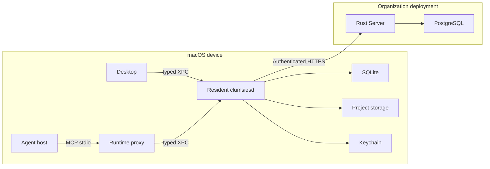

# 系统架构

Clumsies 把两件事放在不同的地方完成：**在开发者的 Mac 上保存提案、同步和检索；在组织的 Server 上管理共享内容并决定发布。** Desktop 和 Agent 都通过同一个本地后台进程工作，它们的 Draft 来自同一份本地状态。

读完本页，你应能回答：一个请求经过哪些进程、数据存在哪里、哪个组件有权修改它，以及系统为何这样拆分。建议先读[认识 Clumsies](/zh/overview)；具体字段见[核心数据结构](/zh/data-model)。

## 一张图看清组件

图中左侧是用户的 macOS 设备，右侧是组织部署的服务。登录、首次配置和管理员恢复使用独立路径，见下文。

| 组件 | 它是什么 | 在部署回滚清单示例中负责什么 |
| --- | --- | --- |
| Desktop | Swift 原生 macOS 应用 | 展示清单、编辑正文、审阅差异、确认发布 |
| Agent host | 用户运行编码 Agent 的宿主 | 在任务中调用 `memory` 工具 |
| Runtime proxy | App 内 `clumsiesd` 的协议代理进程 | 把 MCP 转成有类型的本地请求 |
| Resident daemon | 由 launchd 管理的常驻 Rust `clumsiesd` | 保存 Draft、同步、准备有效内容、执行检索 |
| Server | 使用 Axum 的 Rust HTTP 服务 | 鉴权、保存共享 Draft/Review、事务发布、提供版本快照 |
| PostgreSQL | Server 使用的关系数据库 | 持久化成员、正式内容、提案、Review 和版本历史 |

proxy 和 daemon 使用 App 内**同一份可执行文件**，只是启动方式不同。普通启动运行常驻服务，`mcp serve` 运行 MCP 代理。代理不打开业务数据库、不加载模型，也不运行同步 worker。

## 为什么拆成这几层

**界面关闭不应中断后台工作。** 用户关掉 Desktop 窗口后，Agent 仍可能查询或修改清单。把 Draft 和队列交给 daemon，能让编辑结果独立于窗口保存，也让 Desktop 和 Agent 共用同步与检索实现。

**本地写入和组织发布具有不同的权限与可用性要求。** 网络暂时不可用时，已经持久化的编辑应该保留；但某台 Mac 无权直接宣布它是全组织的正式版本。Server 集中校验成员权限、Draft 版本和发布时的最新状态。

**内容快照和搜索索引具有不同的职责。** 已发布的 Commit 是要核验的版本事实；索引是由内容生成、可以重建的查询结构。索引构建失败不能改变正式内容，更不能让不匹配的索引冒充当前数据。

## 数据存在哪里

“本地数据”包含不可丢失的编辑，也包含可以重建的缓存，不能一概清空。

| 位置 | 保存什么 | 数据性质 |
| --- | --- | --- |
| Server PostgreSQL | Organization/Project、成员、正式 Memory、Draft/Review、Blob/Tree/Commit/Ref、审计 | 多人共享的服务端状态；Organization Ref 决定当前正式版本 |
| daemon 中心 SQLite | 本机 Project 绑定、Draft 与操作队列、同步对象和 Ref 副本、检索历史 | 包含尚未上传的编辑；不是可随意删除的缓存 |
| Project Local Storage | 已验证 Commit 的文件快照、有效内容的检索索引 | 按 Project 管理、可重建的派生数据 |
| macOS Keychain | Server access/refresh token pair | 凭据；与正文和 SQLite 分开存储 |
| daemon 模型缓存 | embedding、reranker 模型文件 | 多个 Project 共用的本机检索依赖 |

Project Local Storage 可以配置到用户选择的位置；Server 不保存这条本机路径和 macOS bookmark。移动时先在目标位置构建并校验，再切换登记位置。已开始的读取完成前不会清理原位置。细节见[本地运行时](/zh/runtime)。

## 正式内容如何变成 Agent 读到的内容

假设组织发布了“部署回滚清单”，一个 Project 选择了它。

1. **Organization Ref** 指向组织当前发布的 Commit。Ref 是可移动的头指针，Commit 是不可变快照。
2. **Project selection** 保存要使用的 Memory ID。Server 为选择结果生成 Project 的 Commit 和 Ref，这叫“投影”。它没有独立发布组织正文的权限。
3. daemon 下载 Project Commit，校验 Tree、Blob、路径和归属，把它安装为本地文件快照（generation）。
4. 对没有 Draft 的资源使用这个投影中的内容；有活动 Draft 的资源，用该 Draft 的 **Base 快照 + 操作** 算出完整结果，覆盖同一资源。这得到 **Effective Memory（有效记忆）**。
5. `activate` 在与有效内容哈希匹配的索引上检索；`load` 按 ID 或路径读取当前完整资源。

新建 Draft 可以还没有既有资源；组织尚无快照时 Base 也可为空。上游清单更新时，已有 Draft 的 Base 不会自动前移。否则同一串操作可能悄悄作用在另一份正文上。系统显式报告 `behind`，通过三方比较让用户确认新的结果。

每次读取使用可识别的快照，但两次独立调用之间内容仍可能变化。更新前应重新 `load` 并携带其 `content_hash`；不要假设较早一次检索等于随后写入时的内容。版本字段之间的区别见[数据结构](/zh/data-model)。

## 一次修改经过哪些边界

| 阶段 | 请求与处理 | 成功能证明什么 |
| --- | --- | --- |
| 本地保存 | Desktop 或 MCP → daemon；SQLite 事务写入 Draft 操作与待同步队列 | 这台设备已保存编辑 |
| 同步 | daemon → Server HTTP；创建/复用 Draft、追加操作、拉取变化 | Server 已保存共享提案 |
| 提交 Review | Desktop → daemon → Server；携带有序 Draft、版本与所需协调候选 | 整组提案已进入审阅 |
| 发布 | Desktop 的 Approve 调用 merge；Server 校验角色、Review/Draft 状态与 Ref，并执行事务 | 整组修改写为一个结果 Commit，Organization Ref 前进 |
| 准备读取 | Server 刷新受影响 Project 投影；daemon 下载、校验、安装并准备索引 | 该设备能用新版本回答 Agent |

HTTP 的独立 `approved` 决定本身不发布内容；当前 Desktop 的 Approve 使用 merge 路由完成发布。Server 支持从 `open` 或 `approved` Review 合并。详见[领域接口](/zh/reference/domain-api)与[完整流程](/zh/flows)。

本地保存、上传、Commit 下载、索引准备和页面展示各有完成条件。“提交成功后页面仍在加载”应沿这些边界分别测量，不能仅用一个 HTTP `200` 判断整个操作已就绪。

## Server 内部按哪些领域组织

这些领域是同一个 Server 进程里的模块，并非需要分别部署的微服务。

| 领域 | 核心问题 | 代码入口 |
| --- | --- | --- |
| Installation | 首次配置如何完成、何时允许初始化 | `installation/` |
| Auth | 用户是谁、会话是否有效 | `auth/` |
| Organization | 成员、角色和 Project 访问权是什么 | `organization/` |
| Memory | 正式内容、选择集合、Bundle 与版本快照是什么 | `memory/` |
| Changes | Draft 如何同步、协调、审阅和发布 | `changes/` |

这些目录位于 `crates/server/src/`。HTTP 层解析请求和响应；服务/存储代码执行用例、授权与 PostgreSQL 事务。全量路由统一装配在 `http.rs`。按操作查入口见[代码库地图](/zh/repos)。

## 身份和信任边界

- **用户登录：** Desktop 通过系统浏览器进入组织 OIDC 身份提供方。Server 验证身份，Desktop 交换授权码后经 XPC 把 token pair 交给 daemon，由 Keychain 保存。普通 Server 请求由 daemon 注入 bearer token。
- **Project 绑定：** daemon 用规范化 Server 地址和当前目录的最长已绑定祖先解析 Project。纳管 Agent 代理重新验证绑定和运行版本，避免继续操作已经换绑的项目。
- **发布授权：** 普通 Project 成员可以提出和提交修改；Organization owner/admin 决定组织发布。角色检查通过后仍须通过版本和 `If-Match` 并发检查。
- **本地诊断：** 检索历史和宿主 Activity 投影留在本机；这与要同步到 Server 的 Draft 正文是两类数据。

首次配置和 daemon 故障时的管理员恢复，由 Desktop 对可信 Server origin 直接发起受限 HTTPS 请求。这是图中普通数据路径之外的例外。Admin API 使用 bearer 鉴权；首次安装的 setup cookie/CSRF 不能被理解为一个通用浏览器管理会话。详见[认证与会话](/zh/reference/auth)。

## 失败时保住什么

| 故障 | 保留的状态与处理原则 |
| --- | --- |
| Draft 上传失败 | 已提交本地事务的操作仍在队列；修复连接或登录后重试 |
| 上游变化、候选或版本过期 | 拒绝过期提交/合并，重新读取、比较并确认；不能覆盖并发发布 |
| Commit 下载或内容校验失败 | 不安装半成品快照、不推进对应本地 Ref |
| 索引与有效内容不匹配 | 报告准备中或失败；不能使用错误版本索引回答 |
| 自定义存储卷不可用 | 报告存储不可用；中心 SQLite 中的 Draft 与队列仍在 |
| Agent proxy 与 daemon 版本不同 | 返回明确的运行版本不匹配；更新后重启相关进程 |

操作性排查见[排查问题](/zh/guides/troubleshooting)。当前仍使用完整 Commit payload 下载，没有增量对象传输；本地运行平台是 macOS launchd/XPC。字段兼容性和已知实现缺口集中在[数据结构](/zh/data-model)、[HTTP 契约](/zh/reference/http-api)及相关专题页，不把设计目标当作已经实现的保证。

## 对照实现继续阅读

- [Server 路由装配](https://github.com/lilhammerfun/clumsies/blob/5d038ffb0ad6e170680618a8fcd0e1ff3d760f77/crates/server/src/http.rs)：领域接口及鉴权分组。
- [daemon 启动](https://github.com/lilhammerfun/clumsies/blob/5d038ffb0ad6e170680618a8fcd0e1ff3d760f77/crates/daemon/src/main.rs)：resident/proxy 模式与后台 worker。
- [Draft 同步](https://github.com/lilhammerfun/clumsies/blob/5d038ffb0ad6e170680618a8fcd0e1ff3d760f77/crates/daemon/src/draft.rs)、[Commit 安装](https://github.com/lilhammerfun/clumsies/blob/5d038ffb0ad6e170680618a8fcd0e1ff3d760f77/crates/daemon/src/commit_sync.rs)、[有效内容覆盖](https://github.com/lilhammerfun/clumsies/blob/5d038ffb0ad6e170680618a8fcd0e1ff3d760f77/crates/daemon/src/search/overlay.rs)：三个不同的数据处理阶段。
- 下一页：[核心数据结构](/zh/data-model)，把图中的名词落实为对象、字段与关系。

服务端源码按资源组织在 `crates/server/src/app/` 下。每个资源按需包含 `routes.rs`、`handler.rs`、`dto.rs`、`service.rs`、`repository.rs` 和 `model.rs`；外部客户端归资源所有，共享数据库设施位于 `infra/`，显式维护命令位于 `maintenance/`。目录、依赖边界和验证方式见 [Server 源码说明](https://github.com/lilhammerfun/clumsies/blob/main/crates/server/README.md)。
