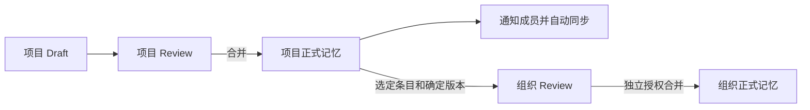

# Project 与 Organization 的 Memory 归属

决策确认：2026-09-23。实现状态：本次改动落地。

本决策替代[统一 Memory 设计](/zh/unified-memory-model)及 [2026-08-26 权威切换](/zh/project-authority-migration)中“只有 Organization 可以发布正式记忆”的**目标设计**。旧页面保留历史切换记录；本文描述当前归属契约。

## 问题与决策

Project 必须能够接受只适用于本项目的知识，而不必同时发布到 Organization。例如，Payments 可以审核通过自己的部署回滚检查单，即使它还不适合其他项目。之后整理出的通用检查单，可以独立贡献给组织。

保留一种 Memory 类型和一套 Draft/Review 机制，允许两种归属：某个 Project 或 Organization。每个 Review 只有一个发布目标。在项目内编辑默认写入该 Project；向 Organization 贡献必须明确发起。

| 概念 | 职责 |
| --- | --- |
| Project Memory | 项目已接受的正式知识，供项目成员共享。 |
| Organization Memory | 已接受的共享知识，供各项目选用。 |
| Project Org Selection | 对组织资源的读取关系，不附带写回权限。 |
| Draft / Review | 针对单一目标的有序修改，使用该目标的版本与权限。 |
| 成员本地安装 | 同步快照与本地提案，不是独立的正式发布分支。 |

## 发布与成员同步

保存创建持久化 Draft 并安排同步，不发布到 Project 或 Organization。草稿预览必须能与正式基线区分；能够看到提案，不代表全体成员已经接受它。

Project Review 合并只修改项目拥有的资源、推进项目快照，并记录供成员通知和同步的更新。Organization 发布需要独立且经过授权的 Review。项目维护权限不授予组织发布权限。

每个项目只有一份当前正式快照，由项目正式 Memory 和选用的 Organization Memory 组合而成，明确关联的项目适配优先。Project Ref 继续作为下载单元；选用的组织资源更新可以刷新这份快照，但不修改项目拥有的资源。本机安装的快照与检索索引必须标明实际包含的内容版本。

| 成员状态 | 项目更新后的行为 |
| --- | --- |
| 没有未合并修改 | 自动安装新快照，记录更新通知，无需成员确认。 |
| Draft 可以无冲突协调 | 使用版本检查，自动协调到新基线；已批准结果发生变化时，旧批准失效。 |
| Draft 存在冲突 | 保留草稿及其基线，通知作者；不把未解决操作套到新基线上，不阻塞其他成员。 |
| 离线或同步失败 | 重试同步，将安装状态与发布状态、内容冲突分别显示。 |

复用 Base / Current / Draft Result 三方比较。可以无冲突协调不代表可以自动发布。候选过期时重新计算；重试不得覆盖更新的编辑或丢弃先前草稿版本。读取、索引有冲突的预览时必须保留其来源，不能将其描述为当前正式快照。

## 组织引用与项目适配

项目有两种使用组织资源的方式：

- **直接引用：** 跟随该资源的组织正式版本。Organization 发布后刷新选用项目的快照，成员收到更新。
- **项目适配：** 在项目中编辑引用资源时，为一个具有独立 ID 的项目资源创建 Project Draft，并记录来源组织资源 ID 和确切版本。Project 合并后，全体项目成员使用适配版；来源后续变化只提示更新，不覆盖项目适配。

优先关系由明确的来源关联决定，不由文件同名决定。无关联资源的路径冲突必须处理，不能静默覆盖。取消选用不删除组织内容；来源删除也不能删除已接受的项目适配。

将适配版恢复为直接引用，是明确的项目变更。向组织贡献不会自动删除适配版或改变其归属。

## 可选的 Organization 贡献

项目 Review 界面只提供一个 **“贡献给组织”** 开关，默认关闭。开启后包含本次 PR 中所有新增或更新的文件，无需再次选择文件或配置目标。项目删除操作，以及协调后已无改动的 Draft，不进入组织贡献。项目适配自动提议更新其记录的组织来源；其他文件按项目路径提议新建组织记忆。同名文件不自动视为同一资源。用户可以一次提交，但底层是两个独立审阅的变更：

贡献意图需要持久化。项目合并后，从该次 Project Commit 的选定资源创建关联的组织提案，保留来源 Review 与 Commit。项目之后的编辑不能改变已提交的组织提案。更新已有组织 Memory 时，需要明确组织基线，并与组织当前版本协调。

创建重试必须返回同一个关联提案。创建失败可见、可重试，不撤销已完成的项目发布。组织拒绝或延迟审阅，都不改变项目已经接受的结果。内容通用化发生在组织提案中，并在那里接受审核。

作者也可以直接提出组织修改，无需先创建项目 Review。不提供一次同时向两个归属发布的 Review，也不增加独立的“晋升”生命周期。

## 实施顺序与验收

实现与验收覆盖以下范围。多账户验收可在隔离 Dev Instance 中运行 `python3 dev/test-memory-ownership.py`。

| 步骤 | 改动范围 | 必须具备的验证证据 |
| --- | --- | --- |
| 1. 归属与迁移 | `crates/server/` 下的 `migrations/`、`src/app/memory/`、`src/app/commit/`、`src/maintenance/project_authority.rs` | 通过新迁移解除 Project 权威禁令；项目快照包含自有与选用资源；保留既有组织身份、历史及归档项目数据。 |
| 2. 单目标发布 | Server 的 `src/app/draft/`、`src/app/review/`、项目授权与 OpenAPI | Project 合并不改变 Org 资源或 Org Ref；Org 合并检查组织权限；拒绝混合目标 Review 和跨项目写入；项目维护者合并项目 Review 无需组织发布权限。 |
| 3. 编辑、同步与检索 | `crates/daemon/src/agent_runtime/`、`draft.rs`、`commit_sync.rs`、`search/`；macOS Memory、Review 功能及服务 | 项目编辑默认 Project scope，包括创建适配；store 仍只保存 Draft；验证双成员合并后同步、无冲突协调、冲突、离线重试、批准失效及索引版本一致。 |
| 4. 关联贡献与通知 | Review DTO/service、现有 inbox/同步机制、macOS Review 界面 | 重试只生成一个引用确定版本的 Org 提案；Org 拒绝不撤销项目合并；通知限定在对应项目，需要处理冲突时通知相关作者。 |
| 5. 契约与用户文档 | Server OpenAPI、daemon MCP 合同、集成说明、中英文模型页及指南 | 归属、草稿预览、引用、适配、贡献目标和实际发布状态全链路一致；与实现同步替换现有行为文档。 |

迁移不能根据最初提交 Organization 资源的项目猜测其归属：其他项目可能已经选用了它。已有 Org Draft 不能静默变成 Project Draft。恢复项目发布前，需要盘点数据并制定明确的迁移方案，在数据库副本上验证回滚及本地队列保留。不能通过原地修改 scope 或删除共享资源来逆转历史迁移。

验证至少覆盖：项目与组织权限分离、同路径资源身份、存在适配时的来源更新与删除、双成员同步、并发草稿编辑，以及项目发布成功后的贡献创建重试。相关自动化用例位于服务端归属测试、daemon 集成测试及原生 macOS 测试中。

## TeamAI 参考边界

核对版本为 [TeamAI `8d74aa4`](https://github.com/Tencent/teamai-cli/tree/8d74aa4e42793bffbb501451a3c7ae33ebe8985e)。其[双仓库组合](https://github.com/Tencent/teamai-cli/blob/8d74aa4e42793bffbb501451a3c7ae33ebe8985e/docs/usage-guide.zh-CN.md#在项目仓库下叠加组织级仓库)和[单仓库 push 目标](https://github.com/Tencent/teamai-cli/blob/8d74aa4e42793bffbb501451a3c7ae33ebe8985e/src/push.ts#L321-L333)支持“读取组合，写入分离”的边界。它的 project/user scope 表示安装位置，不等于 Clumsies 的内容归属。

不复制经验笔记直接推送的独立生命周期，不用文件复制替代草稿协调。保留 Clumsies 的资源 ID、审阅发布、版本检查和持久化提案；本决策不要求引入 Git 存储或新增 Memory 分类。
